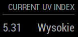

# MMM-uv-index

UV Index from openweathermap.org for [MagicMirror²](https://github.com/MagicMirrorOrg/MagicMirror).



## Usage 

To use this module, go to the *modules* subfolder of your mirror and clone this repository. You will need a subscription to the Openweathermap OneCall API 3.0. The first 1000 calls are free, so personal use should incur no cost. Set the rate limit to 999 per day to make sure you don't get charged, even if the module or MagicMirror were to get stuck in a loop somehow.

```bash
git clone https://github.com/thariq-shanavas/MMM-uv-index
```

### Configuration

To run the module, you need to add the following data to your config.js file.

```js
{
  module: 'MMM-uv-index',
  position: 'bottom_right',
  header: 'Current UV Index',
  config: {
    lat: 52.229771, // lattitude http://openweathermap.org/help/city_list.txt
    lon: 21.011780, // longtitude, Warsaw
    appid: 'xyz', // openweathermap.org api key
    colors: true,
  }
}
```

You may want to set the following options in the config section as well:

| Option |  Description | 
|---|---|
| `lat` | Lattitude value from your location to show UV Index.<br><br>This is **REQUIRED**. | 
| `lon` | Longtitude value from your location to show UV Index.<br><br>This is **REQUIRED**. | 
| `animationSpeed` | Speed of the update animation. (Milliseconds)<br><br>**Possible values:** `0` to `5000`<br>**Default value:** `1000` (1 second) | 
| `colors` | Makes UV scale name colorful<br><br>**Possible values:** `true` or `false`<br>**Default value:** `true` | 
| `updateInterval` | How often would you like to update data? (Miliseconds)<br><br>**Default value:** `3600000` (1 hour)<br>[Used Scale](https://www.epa.gov/sunsafety/uv-index-scale-1)| 

## Supported languages

- English
- Dutch
- Polish

Feel free to open new issue and submit translation for your language!

## Known Issues


## Changelog

### 1.0.1 - 07.05.2018

- Added Dutch language [ISSUE](https://github.com/Sketusky/MMM-uv-index/issues/1)
- Introduced changelog and version information

### 1.0.0 - 03.05.2018

- First working version of module
