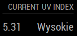

# MMM-uv-index

MMM-uv-index is a module for [MagicMirror²](https://github.com/MagicMirrorOrg/MagicMirror) to display the UV index from openweathermap.org for your loaction.



## Requirement

You will need a subscription to the OpenWeather One Call API 3.0. The first 1000 calls are free, so there should be no cost for personal use. Set the rate limit to 999 per day to make sure you don't get charged even if the module or MagicMirror somehow gets stuck in a loop.

## Installation

To use this module, go to the *modules* directory of your mirror and clone this repository.

```bash
cd ~/MagicMirror/modules
git clone https://github.com/thariq-shanavas/MMM-uv-index
```

## Update

Just enter the modules's directory and pull the new version of the module:

```bash
cd ~/MagicMirror/modules/MMM-uv-index
git pull
```

## Configuration

To run the module, you need to add the following data to your `config.js` file.

```js
    {
      module: 'MMM-uv-index',
      position: 'bottom_right',
      header: 'Current UV Index',
      config: {
        lat: 52.229771, // lattitude
        lon: 21.011780, // longtitude, Warsaw
        appid: 'xyz',   // openweathermap.org API key
        colors: true,
      }
    },
```

### Configuration options

You may want to set the following options in the config section as well:

| Option | Description |
|---|---|
| `lat` | Lattitude value from your location to show UV index.<br><br>This is **REQUIRED**. |
| `lon` | Longtitude value from your location to show UV index.<br><br>This is **REQUIRED**. |
| `animationSpeed` | Speed of the update animation. (milliseconds)<br><br>**Possible values:** `0` to `5000`<br>**Default value:** `1000` (1 second) |
| `colors` | Makes UV scale name colorful<br><br>**Possible values:** `true` or `false`<br>**Default value:** `true` |
| `updateInterval` | How often would you like to update data? (miliseconds)<br><br>**Default value:** `360000` (1 hour)<br>[Used Scale](https://www.epa.gov/sunsafety/uv-index-scale-1)|

## Supported languages

- de - German
- en - English
- nl - Dutch
- pl - Polish

Feel free to open new issue and submit translation for your language!

## Changelog

### 2.0.0 - 03.07.2023

- Update to OneCall API 3.0

### 1.0.1 - 07.05.2018

- Added Dutch language [ISSUE](https://github.com/Sketusky/MMM-uv-index/issues/1)
- Introduced changelog and version information

### 1.0.0 - 03.05.2018

- First working version
